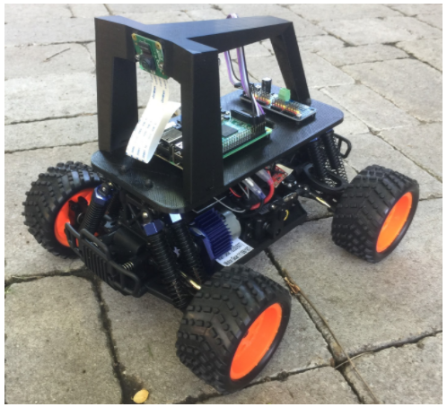
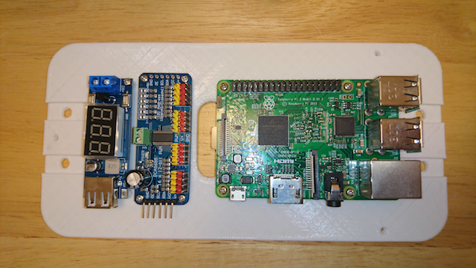
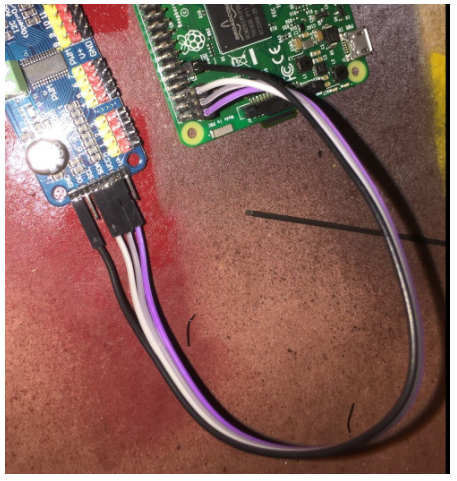
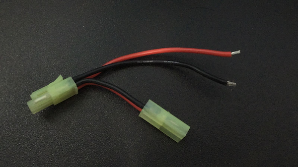
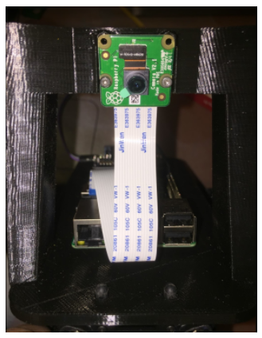
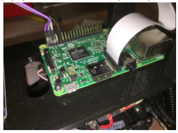

# How to Build a Donkey V2

&nbsp;

* [Overview](build_hardware.md#overview)
* [Parts Included](build_hardware.md#parts-included)
* [Hardware:](build_hardware.md#hardware)
    * [Step 1: Attach Raspberry Pi, Servo Driver, and Voltage Converter to 3D Printed Base Plate](build_hardware.md#step-1-attach-raspberry-pi-servo-driver-and-voltage-converter-to-3d-printed-base-plate)
    * [Step 2: Assemble Base Plate and Roll Cage](build_hardware.md#step-2-assemble-base-plate-and-roll-cage)
    * [Step 3: Connect Servo Driver and Voltage Converter to Raspberry Pi](build_hardware.md#step-3-connect-servo-driver-and-voltage-converter-to-raspberry-pi)
    * [Step 4: Attach Camera](build_hardware.md#step-4-attach-camera)
    * [Step 5: Put it all together](build_hardware.md#step-5-put-it-all-together)
 * [Software](install_software.md)

&nbsp;

## Overview

These are instructions for the [Donkey Car Starter Kit](https://www.robocarstore.com/products/donkey-car-starter-kit) purchased from [Robocar Store](https://robocarstore.com/).
For instructions of the vanilla Donkey Car, please visit https://docs.donkeycar.com.

## Parts Included:

| Part Description | Quantity |
| --- | --- |
| HSP 94186 Remote Controlled Car | 1 |
| NiMH Battery | 1 |
| NiMH Battery Charger | 1 |
| HSP 94186 Manual / Stickers / Accessories | 1 |
| Raspberry Pi 3B | 1 |
| 3D Printed Roll Cage | 1 |
| 3D Printed Base Plate | 1 |
| Wide Angle Camera | 1 |
| Camera Cable | 1 |
| Female-Female Jumper Wire | 4 |
| 16GB Micro SD Card | 1 |
| SD Card Adapter | 1 |
| 16-Channel Servo Driver PCA9685 | 1 |
| DC-DC 5V/2A Voltage Converter | 1 |
| M3x12mm Screws | 3 |
| M2.3x6mm PT Screws | 10 |
| M2x6mm Screws | 4 |
| Mini Tamiya splitter | 1 |
| USB Cable | 1 |

## Hardware

&nbsp;
### Step 1: Attach Raspberry Pi, Servo Driver, and Voltage Converter to 3D Printed Base Plate
Attaching the Raspberry Pi, Servo Driver, and Voltage Converter is as simple as running screws through the board into the screw bosses on the base plate.  The 10 M2.3x6mm screws should be perfect to go through the holes and hold the components securely.  The ethernet and USB ports should face forward.  This is important as it gives you access to the SD card and makes the camera ribbon cable line up properly.

&nbsp;
### Step 2: Assemble Base Plate and Roll Cage
Use the 3 M3x12mm screws from the bottom of the base plate to attach and hold the roll cage on top of it.

&nbsp;
### Step 3: Connect Servo Driver and Voltage Converter to Raspberry Pi
You could do this after attaching the Raspberry Pi to the base plate, I just think it is easier to see the parts when they are laying on the workbench.  Connect the parts as you see below:

For reference, below is the Raspberry Pi Pinout for reference.  You will notice we connect to 3.3v, the two I2C pins (SDA and SCL) and ground:

Attach the open end of the mini Tamiya splitter to the Voltage Converter.  Loosen the screws in the blue connectors of the Voltage Converter and connect red wire to the IN+ side and black wire to the IN- side.  Attached the female mini Tamiya adapter to the wire from the ESC of the car.  Leave the male adapter for now, it will be connected to the battery to draw power for the Raspberry Pi before you start the car.  Attach the USB cable between the Voltage Converter and the Raspberry Pi.

&nbsp;
### Step 4: Attach Camera
Attaching the camera is a little tricky, the M2x6mm screws can be screwed into the plastic but it is a little hard.  I recommend drilling the holes out with a 1.5mm bit (1/16th bit in Imperial land) then pre threading them with the screws before putting the camera on. It is only necessary to put two screws in.

>Sometimes using the two top screw holes can result in a short. Put screws in the bottom two holes.

Before using the car, remove the plastic cap from the camera lens.

It is easy to put the camera cable in the wrong way so look at these photos and make sure the cable is put in properly.  There are loads of tutorials on youtube if you are not used to this.

&nbsp;
### Step 5: Put it all together
The final steps are straightforward.  First attach the roll bar assembly to the car.  This is done using the same pins that came with the vehicle.  

Second run the servo cables up to the car.  The throttle cable runs to channel 0 on the servo controller and steering is channel 1.

Now you are done with the hardware!!

&nbsp;
## Software
Congrats!  Now to get your get your car moving, see the [software instructions](install_software.md) section.

> We are a participant in the Amazon Services LLC Associates Program, an affiliate advertising program designed to provide a means for us to earn fees by linking to Amazon.com and affiliated sites.
